# IF3141 Sistem Informasi - Tugas Besar

## Identitas Kelompok

**Kelompok:** G07
**Kelas:** K02

### Anggota Kelompok

| NIM | Nama |
|-----|------|
| 13523062 | Aliya Husna Fayyaza |
| 13523083 | David Bakti Lodianto |
| 13523099 | Daniel Pedrosa Wu |
| 13523100 | Aryo Wisanggeni |
| 13523119 | Reza Ahmad Syarif |

---

## Nama Sistem dan Perusahaan

**Nama Sistem:** M4FR — Sistem Informasi Keuangan Terintegrasi dan Perpajakan

**Perusahaan:** M4FR by Ataya

---

## Deskripsi Sistem

M4FR by Ataya merupakan sebuah perusahaan yang bergerak di bidang produksi garmen (konveksi pakaian) yang melayani pesanan custom dari pelanggan. Dalam menjalankan operasionalnya, perusahaan menghadapi tantangan dalam mengelola alur bisnis end-to-end mulai dari pencatatan pesanan, manajemen produksi, penagihan, pencatatan pembayaran, pengelolaan bahan baku, hingga pelaporan keuangan dan perpajakan. Untuk menjawab kebutuhan tersebut, kami membangun **Sistem Informasi Keuangan Terintegrasi dan Perpajakan** yang dibangun di atas platform Odoo 17 sebagai modul kustom (`m4fr`).

Sistem ini mengintegrasikan lima fungsi utama yang sebelumnya berjalan terpisah, yaitu:

- Manajemen Penjualan — pencatatan pelanggan, pesanan penjualan (quotation hingga sales order), penyesuaian harga, dan tenggat produksi.
- Manajemen Produksi — pelacakan status produksi bertahap (Belum Dimulai → Bahan Diterima → Cutting → Jahit → QC → Selesai) dengan riwayat perubahan dan kontrol akses berbasis peran.
- Manajemen Keuangan — penerbitan tagihan (invoice), pencatatan pembayaran, dan arus kas masuk/keluar.
- Manajemen Pengadaan & Bahan Baku — pencatatan vendor, tagihan vendor, serta pergerakan bahan.
- Pelaporan & Dashboard — laporan pajak dan dashboard ringkasan operasional.

Implementasi *Role-Based Access Control* (RBAC) dengan lima peran (Direktur, Manajer Keuangan, Manajer Produksi, Admin, Kepala Produksi) memastikan setiap pengguna hanya mengakses fitur yang sesuai dengan tanggung jawabnya.

---

## Pre-requisites

Sebelum menjalankan sistem, pastikan dependency berikut sudah terpasang:

1. **Docker Desktop**
   - Download: https://www.docker.com/products/docker-desktop/
2. **Python 3.11**
   - Digunakan untuk virtual environment (venv) pada proses development modul

## Struktur Direktori

- `/config` — Konfigurasi Odoo
- `/custom_addons` — Modul kustom (`m4fr`)
- `/dump` — Database dump untuk import/export
- `/scripts` — Skrip database migration
- `docker-compose.yml` — Orchestration Odoo dan PostgreSQL

---

## Cara Menjalankan Sistem

### A. Setup Awal

#### 1. Jalankan service Odoo dan PostgreSQL

```bash
docker compose up -d
```

> **Expected result:** Container `web` dan `db` berstatus `running`.

#### 2. Buka aplikasi pada browser

Akses `http://localhost:8069`.

> **Expected result:** Halaman login Odoo muncul.

#### 3. Login menggunakan kredensial admin default

- Username: `admin`
- Password: `admin`

> **Expected result:** Berhasil masuk ke dashboard utama Odoo.

#### 4. Aktifkan Developer Mode

Masuk ke **Settings** → aktifkan **Developer Mode**.

> **Expected result:** Menu Developer Tools tersedia.

#### 5. Install modul M4FR

Masuk ke menu **Apps** → klik **Update Apps List** → cari "M4FR" → klik **Install**.

> **Expected result:** Modul M4FR terinstall dan menu **M4FR** muncul di navigasi atas.

#### 6. Login per role untuk pengujian

Logout dari user `admin`, lalu login dengan kredensial role yang ingin diuji (lihat tabel **Kredensial Role** di bawah).

> **Expected result:** Menu yang muncul sesuai dengan hak akses role tersebut.

---

### B. Penggunaan Fitur

#### F-01: Pencatatan Pesanan Penjualan

**Prerequisite:** Login sebagai Admin atau Direktur.

1. Pada menu navigasi, pilih **M4FR → Penjualan → Pesanan**.
2. Klik tombol **New** untuk membuat pesanan baru.
3. Isi field **Customer** dengan memilih atau mengetik nama klien.
4. Isi field **Tenggat Waktu** dengan tanggal dan waktu tenggat pengerjaan (field wajib).
5. Isi jenis pembayaran yang harus diikuti (DP, langsung lunas, dll).
6. Pada tab **Order Lines**, klik **Add a product** untuk menambahkan item pesanan. Isi kolom produk, spesifikasi, kuantitas, dan harga satuan.
7. Jika ada biaya/diskon tambahan, pindah ke tab **Penyesuaian** dan tambahkan baris penyesuaian.
8. Klik **Save** (atau biarkan autosave).

> **Expected result:** SO tersimpan dengan status `Quotation` dan nomor SO ter-generate otomatis.

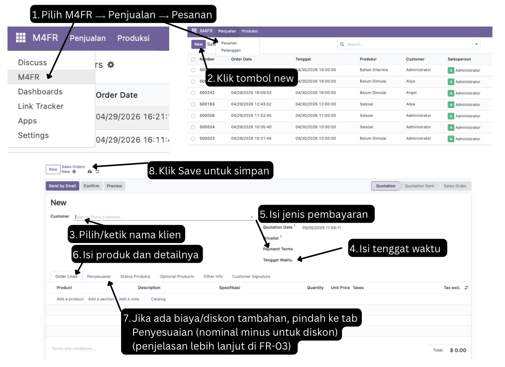

#### F-02: Konfirmasi Pesanan

**Prerequisite:** Login sebagai Admin atau Direktur.

1. Buka SO yang ingin dikonfirmasi dari **M4FR → Penjualan → Pesanan**.
2. Pastikan SO masih berstatus `Quotation` dan data lengkap.
3. Klik tombol **Confirm** di bagian atas form.
4. Cek tab **Status Produksi**, riwayat perubahan status akan tercatat otomatis.

> **Expected result:** Status SO berubah menjadi `Sales Order` dan status produksi otomatis menjadi `Belum Dimulai`.

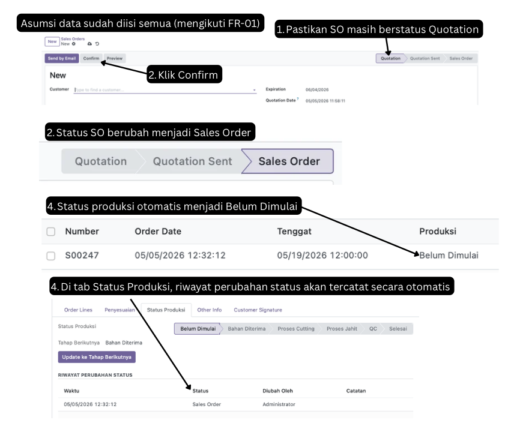

#### F-03: Pencatatan Penyesuaian Harga

**Prerequisite:** Login sebagai Admin atau Direktur.

1. Buka form pesanan dari **M4FR → Penjualan → Pesanan**.
2. Klik tab **Penyesuaian**.
3. Klik **Add a line** untuk menambahkan baris penyesuaian.
4. Isi kolom **Produk/Jenis** (opsional), **Keterangan**, dan **Jumlah** nominal.
5. Klik **Save**.

> **Expected result:** Grand total pada bagian bawah form terupdate otomatis mencakup nilai penyesuaian.

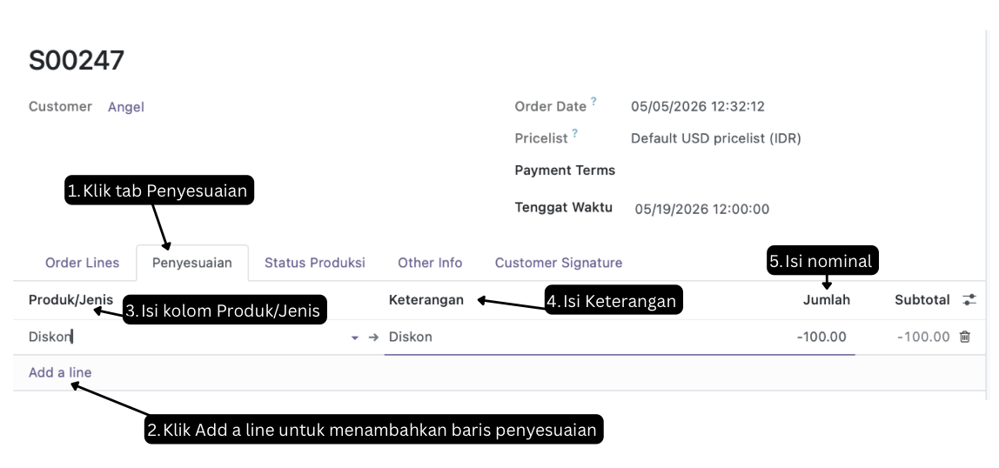

#### F-04: Manajemen Data Pelanggan

**Prerequisite:** Login sebagai Admin atau Direktur.

1. Pilih menu **M4FR → Penjualan → Pelanggan**.
2. Untuk menambah pelanggan baru, klik **New**.
3. Isi field **Nama Pelanggan** (wajib), **Email**, **No. Kontak**, **Alamat**, dan **Kota**.
4. Klik **Save**.
5. Untuk mengedit, buka data pelanggan dari daftar dan ubah field yang diinginkan.
6. Untuk menghapus, buka form pelanggan dan pilih **Action → Delete**.

> **Catatan:** Manajer Keuangan hanya dapat melihat data pelanggan (read-only).

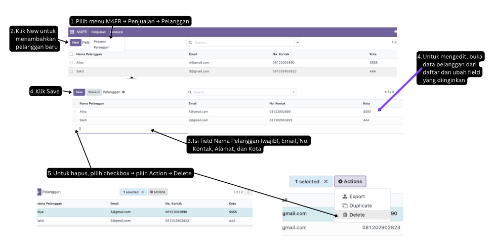

#### F-05: Pemantauan Pesanan Aktif

**Prerequisite:** Login sebagai Manajer Produksi.

1. Pilih menu **M4FR → Produksi → Daftar Pesanan Aktif**.
2. Sistem otomatis menampilkan hanya pesanan dengan status `Sales Order` yang produksinya belum selesai.
3. Klik salah satu baris untuk membuka detail pesanan (form read-only).
4. Pada form detail, lihat tab **Item Pesanan** untuk daftar produk dan spesifikasi.
5. Lihat tab **Riwayat Status Produksi** untuk melihat riwayat perubahan tahapan produksi.

> **Expected result:** Daftar pesanan aktif tampil dalam mode read-only dengan filter otomatis.

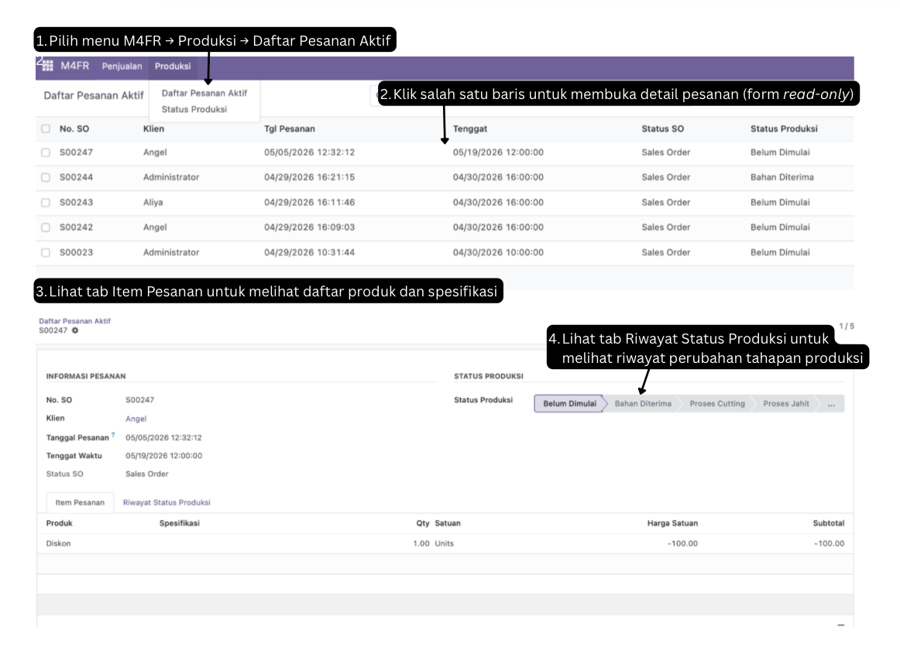

#### F-06: Pembaruan Status Produksi

**Prerequisite:** Login sebagai Kepala Produksi.

1. Pilih menu **M4FR → Produksi → Status Produksi**.
2. Sistem menampilkan daftar SO aktif beserta kolom **Status Produksi** dan **Tahap Berikutnya**.
3. Klik tombol **Update Status** pada baris pesanan (atau buka form pesanan dan klik **Update ke Tahap Berikutnya**).
4. Wizard terbuka menampilkan **Status Saat Ini** dan **Tahap Berikutnya** yang sudah dikalkulasi otomatis.
5. Tambahkan **Catatan** opsional jika diperlukan.
6. Klik **Konfirmasi** untuk menyimpan perubahan.

> **Expected result:** Status produksi pada SO terupdate dan riwayat perubahan tercatat otomatis.

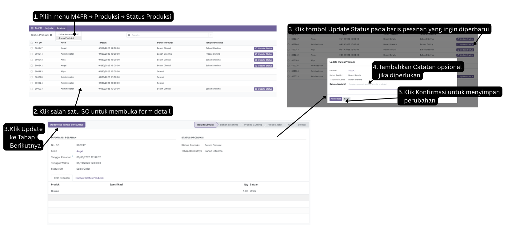

#### F-07: Kelola Pengguna dan Peran

**Prerequisite:** Login sebagai Direktur (JB-01).

1. Buka **M4FR → Pengaturan → Pengguna**.
2. Klik tombol **New** untuk menambahkan pengguna baru, atau pilih pengguna yang sudah terdaftar untuk diperbarui.
3. Isi field **Nama** dan **Email** pengguna.
4. Pada tab **Peran M4FR**, tentukan peran yang sesuai: Direktur, Manajer Keuangan, Manajer Produksi, Admin, atau Kepala Produksi.
5. Untuk mengatur kata sandi, klik **Action → Change Password**, lalu masukkan kata sandi baru (minimal 8 karakter, kombinasi huruf dan angka).
6. Klik **Save**.

> **Expected result:** Hak akses pengguna diperbarui otomatis sesuai peran yang ditetapkan tanpa konfigurasi tambahan.

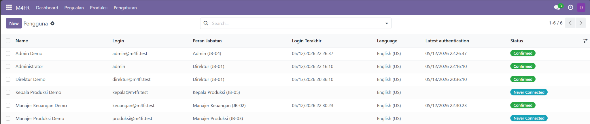

#### F-08: Dashboard Eksekutif

**Prerequisite:** Login sebagai Direktur (JB-01).

1. Pada menu navigasi, buka **M4FR → Dashboard**.
2. Sistem menampilkan halaman dashboard dengan empat widget KPI di bagian atas: **Total Pendapatan**, **Total Pengeluaran**, **Laba Bersih**, dan **Jumlah Pesanan Selesai**.
3. Di bawah widget KPI, tersedia tiga grafik interaktif: bar chart pendapatan vs pengeluaran per bulan, line chart tren laba bersih, dan pie chart komposisi pengeluaran per kategori.
4. Arahkan kursor ke titik data atau segmen grafik untuk menampilkan tooltip detail.

> **Expected result:** Dashboard menampilkan ringkasan KPI dan visualisasi tren keuangan secara real-time.

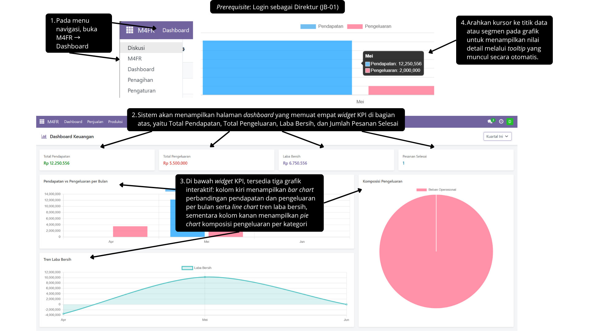

#### F-09: Filter Periode Dashboard

**Prerequisite:** Login sebagai Direktur (JB-01) dan halaman Dashboard sedang terbuka.

1. Pada sisi kanan atas halaman dashboard, terdapat dropdown pemilihan periode.
2. Klik dropdown tersebut, lalu pilih salah satu periode: **Bulan Ini**, **Bulan Lalu**, **Kuartal Ini**, atau **Tahun Ini**.

> **Expected result:** Seluruh widget KPI dan grafik terupdate otomatis sesuai periode yang dipilih tanpa reload halaman.

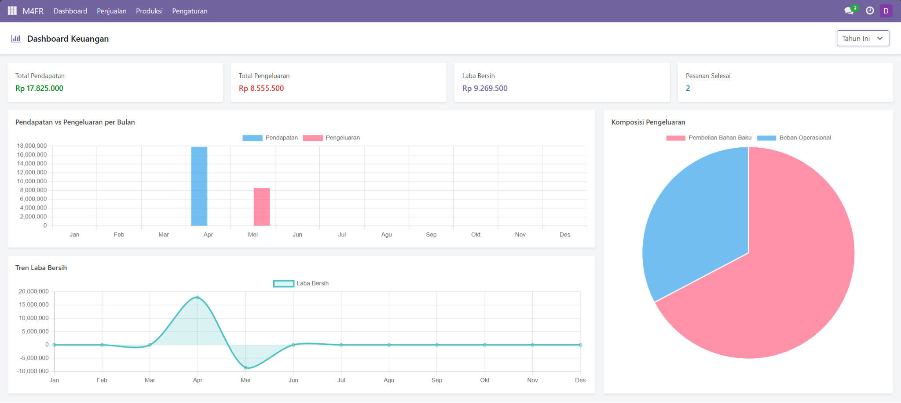

#### F-10: Pembuatan Invoice Otomatis

**Prerequisite:** Login sebagai Admin.

1. Buka Sales Order yang telah dikonfirmasi dari menu **M4FR > Penjualan > Pesanan**.
2. Pastikan SO sudah berstatus `Sales Order`.
3. Klik tombol **Buat Invoice** pada bagian atas form.
4. Pada wizard invoice, tentukan aturan pembayaran DP yang diinginkan (default 50% dari total tagihan).
5. Klik **Konfirmasi** untuk membuat draft invoice.
6. Setelah invoice berhasil dibuat, klik tombol **Kirim Invoice** atau gunakan fitur **Export PDF** untuk mengunduh invoice.

> **Expected result:** Sistem membuat draft invoice secara otomatis berdasarkan data SO, lengkap dengan nomor invoice dan nominal pembayaran DP yang telah dihitung otomatis.

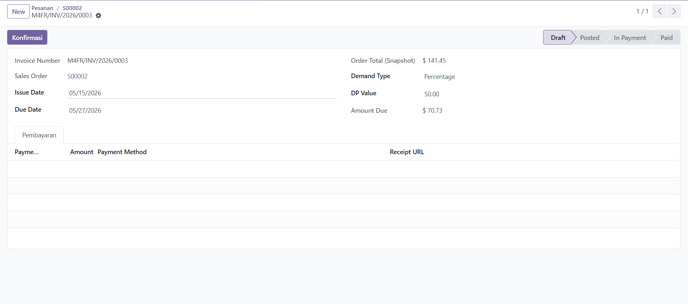

#### F-11: Validasi Pembayaran Uang Muka dan Pelunasan

**Prerequisite:** Login sebagai Admin.

1. Buka Sales Order yang dicari dari menu **M4FR > Penjualan > Pesanan**.
2. Masuk ke halaman invoice melalui tombol **Buat Tagihan**.
2. Pastikan invoice sudah berstatus `Posted`.
3. Klik tombol **Validasi Pembayaran**.
4. Pada wizard pembayaran, masukkan nominal pembayaran DP yang diterima pelanggan.
5. Klik **Validate** untuk mencatat pembayaran DP.
6. Setelah pelanggan melakukan pelunasan, ulangi proses validasi pembayaran untuk sisa tagihan.
7. Sistem akan otomatis memperbarui status invoice dan status pembayaran pada Sales Order terkait.

> **Expected result:** Pembayaran DP dan pelunasan tercatat pada sistem, status invoice berubah menjadi `Paid` setelah seluruh pembayaran selesai, dan transaksi kas masuk otomatis tercatat pada Buku Besar.

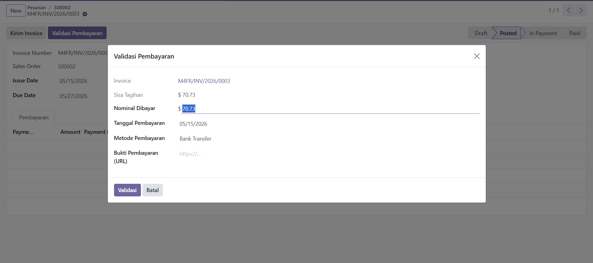

#### F-12: Pemantauan Buku Besar Arus Kas

**Prerequisite:** Login sebagai Direktur atau Manager Keuangan.

1. Buka modul Akuntansi dari menu **M4FR > Akuntansi > Buku Besar**.
2. Sistem akan menampilkan daftar seluruh riwayat transaksi keuangan (uang masuk dan uang keluar).
3. Perhatikan bahwa halaman ini bersifat **read-only** ntuk menjaga integritas data otomatis.
4. Gunakan **search bar** di kanan atas untuk menyaring data dengan klik **Filter** (Kas Masuk / Kas Keluar).
5. Terdapat juga opsi **Group By**(Bulan / Kategori) untuk mengelompokkan tampilan transaksi.
6. Pada bagian paling bawah tabel, terdapat Total Saldo yang terhitung secara otomatis dari selisih debit dan kredit.

> **Expected result:** Riwayat transaksi kas masuk dan keluar ditampilkan secara komprehensif, aman dari manipulasi manual, dan menunjukkan perhitungan total saldo akhir yang presisi.

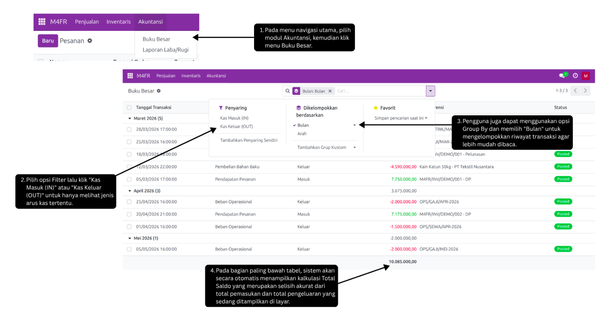

#### F-13: Ekspor Data Buku Besar

**Prerequisite:** Login sebagai Direktur atau Manager Keuangan.

1. Buka modul Akuntansi dari menu **M4FR > Akuntansi > Buku Besar**.
2. Pilih data transaksi yang ingin diekspor dengan mencentang kotak (checkbox).
3. Klik tombol **Action** yang muncul di bagian tengah atas, lalu pilih **Export**.
4. Pada jendela ekspor yang muncul, pilih format keluaran yang diinginkan.
5. Pilih dan pastikan kolom yang ingin diunduh (Tanggal, Kategori, Arah, Nominal) sudah berada di daftar sebelah kanan.
6. Klik tombol **Export** di kiri bawah jendela.

> **Expected result:** Seluruh riwayat transaksi arus kas yang dipilih berhasil diekspor dan diunduh ke dalam format spreadsheet untuk keperluan audit atau pencadangan lokal.

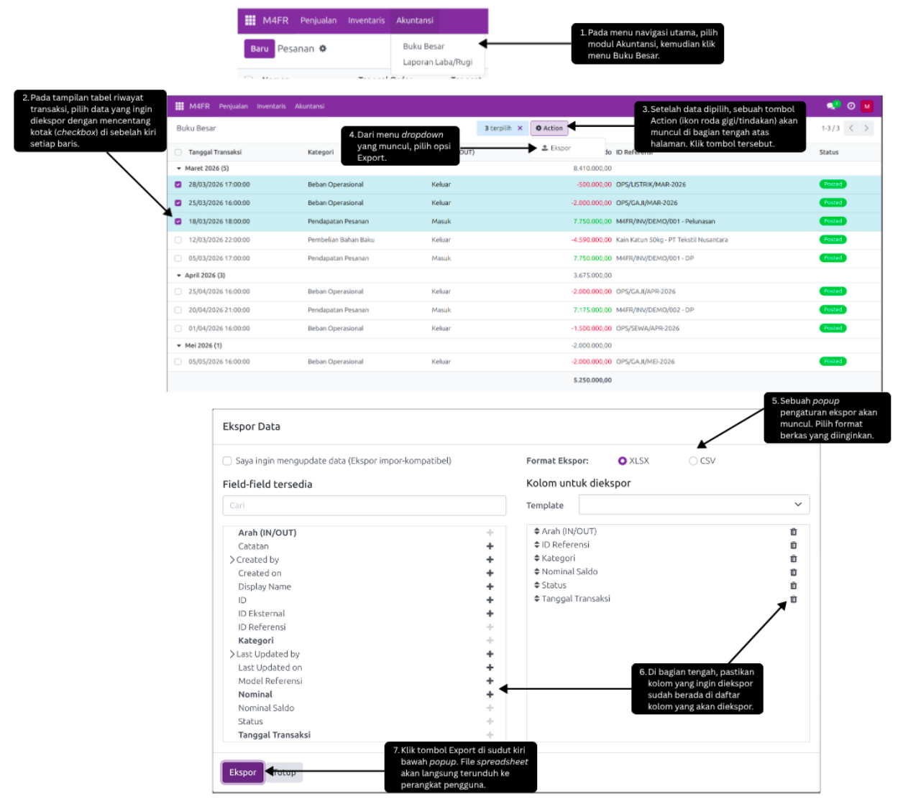

#### F-14: Laporan Laba/Rugi dan Pajak UMKM

**Prerequisite:** Login sebagai Direktur atau Manager Keuangan.

1. Buka modul Akuntansi dari menu **M4FR > Akuntansi > Laporan Laba/Rugi**.
2. Pada wizard interaktif yang muncul, masukkan tanggal pada kolom `Mulai Periode` dan `Akhir Periode`.
3. Sistem akan secara otomatis mengalkulasi dan menampilkan 4 indikator utama secara real-time: **Omzet Bruto**, **Beban Operasional**, **Laba Bersih**, dan **Estimasi Pajak UMKM (0,5%)**.
4. Klik tombol **Ekspor PDF**  di bagian bawah form untuk mencetak laporan.
5. Dokumen PDF berisikan detail keuangan dan perhitungan kewajiban Pajak PP No. 55 Tahun 2022 akan terunduh.

> **Expected result:** Pengguna dapat melihat metrik performa keuangan perusahaan berdasarkan rentang tanggal tertentu, serta berhasil mengunduh dokumen resmi Laporan Laba/Rugi & Pajak UMKM berformat PDF.

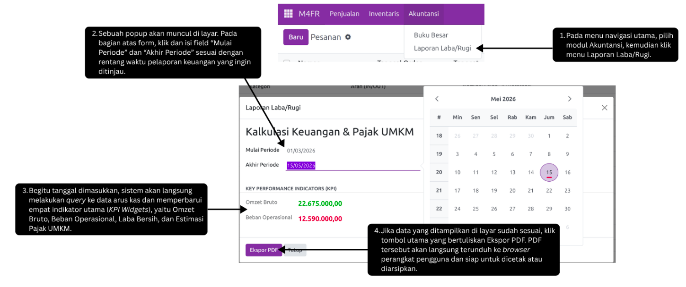

---
#### F-19: Login

1. Masukkan email yang valid dan sudah terdaftar sebagai peran yang sesuai dengan keinginan
2. Masukkan password yang valid dan sudah terdaftar
3. Pilih basis data yang ingin digunakan sebagai inisialisasi basis data
4. Klik tombol login

> **Expected result:** Pengguna dapat masuk ke dalam sistem sesuai dengan perannya.

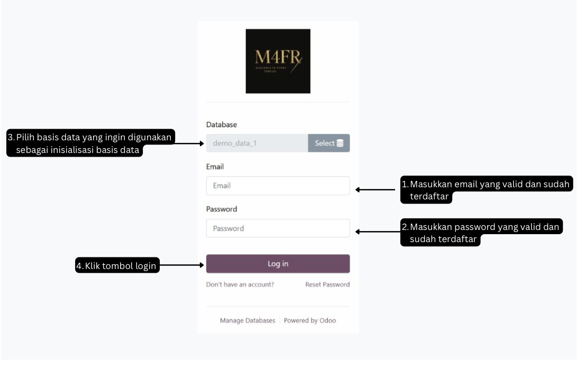

### C. (Opsional) Setup Python Virtual Environment

Untuk pengerjaan/development modul lebih lanjut:

```bash
python3.11 -m venv .venv
source .venv/bin/activate
pip install --upgrade pip
pip install -r requirements.txt
```

---

## Kredensial Role

User berikut dibuat otomatis dari demo data (`custom_addons/m4fr/demo/demo_data.xml`) ketika database dibuat dengan opsi **Demo Data** dicentang. Password seluruh user demo sama: `Password123`.

| Role (Jabatan) | Login (Email) | Password |
|----------------|---------------|----------|
| Direktur (JB-01) | `direktur@m4fr.test` | `Password123` |
| Manajer Keuangan (JB-02) | `keuangan@m4fr.test` | `Password123` |
| Manajer Produksi (JB-03) | `produksi@m4fr.test` | `Password123` |
| Admin (JB-04) | `admin@m4fr.test` | `Password123` |
| Kepala Produksi (JB-05) | `kepala@m4fr.test` | `Password123` |

### Hak Akses Utama per Role

- **Direktur (JB-01)** — Akses penuh seluruh modul (implies semua role) + manajemen user.
- **Manajer Keuangan (JB-02)** — Tagihan, pembayaran, arus kas, laporan pajak. Read-only pada pesanan & pelanggan.
- **Manajer Produksi (JB-03)** — Lihat daftar pesanan aktif (read-only).
- **Admin (JB-04)** — Pencatatan pelanggan, pesanan penjualan, dan manajemen SO.
- **Kepala Produksi (JB-05)** — Update status produksi (cutting → sewing → QC → done).

> **Catatan:** Untuk kredensial superuser Odoo gunakan `admin` / `admin`. Jika database dibuat tanpa demo data, user di atas tidak akan ada — perlu dibuat manual via Settings > Users atau gunakan import DB dump.

---

## Database Migration

Odoo menggunakan local database. Untuk migrasi (export/import) database antar anggota tim, **selalu hentikan service** terlebih dahulu:

```bash
docker compose down
```

### Export Database

- macOS/Linux:
  ```bash
  ./scripts/export_db.sh
  ```
- Windows:
  ```bat
  scripts\export_db.cmd
  ```

### Import Database

- macOS/Linux:
  ```bash
  ./scripts/import_db.sh
  ```
- Windows:
  ```bat
  scripts\import_db.cmd
  ```

---

## Kesimpulan dan Saran

Pembangunan sistem M4FR berhasil mengintegrasikan proses bisnis utama M4FR by Ataya ke dalam satu platform terpadu berbasis Odoo 17. Penerapan *Role-Based Access Control* memastikan setiap fungsi bisnis (Direktur, Admin, Manajer Keuangan, Manajer Produksi, Kepala Produksi) hanya dapat mengakses modul yang relevan dengan tanggung jawabnya, sehingga keamanan data dan akuntabilitas operasional terjaga.

Untuk pengembangan lanjutan, kami menyarankan beberapa hal:
- Integrasi dengan sistem perbankan untuk rekonsiliasi pembayaran otomatis
- Penambahan modul *forecasting* permintaan dan kebutuhan bahan baku berbasis data historis
- Pengembangan mobile interface untuk Kepala Produksi agar update status produksi dapat dilakukan langsung dari lantai produksi
- Penambahan integrasi e-Faktur untuk otomatisasi pelaporan pajak ke DJP. Selain itu, performa sistem perlu terus dipantau seiring bertambahnya volume transaksi agar pengalaman pengguna tetap optimal.
